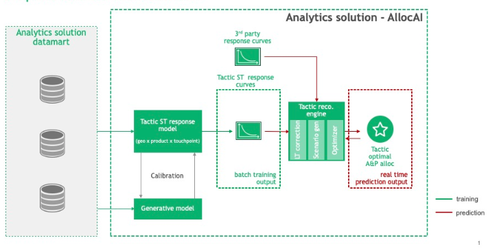
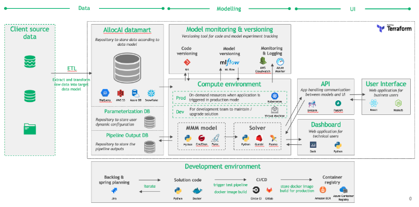

Team: David Galley, Caroline Pansard, Jiaqi Zhang

## Problem Overview
*Key question: Where should I spend my marketing dollars to maximize impact on sales?*

Complications: (1) very difficult in general to attribute marketing spend to sales value 
for any given touchpoint (2) there is very little data for any given product-touchpoint
 combination since products and market conditions are constantly changing.

Main idea: We know from past experience the rough shape of a response curve for any
given touchpoint. If we impose this structure on our problem, the search space 
becomes much smaller (more constrained).


## Solution Design
*Similar to mining casework, we use our bayesian model to build a surrogate of the 
system we are trying to optimize, then use an algorithm to find best recipe.*

- **Data Cube**: historical datamart that combines 3 years of spend, promotions, 
sales, market and brand databases (weekly level for all products and 
touchpoints).

- **Marketing Mix Modeling**: uses bayesian statistics to determine the contribution 
waterfall for product and the responsive curve for each product-touchpoint (sales 
uplift x touchpoint spend).

- **Optimisation**: Mixed Integer Programming (MIP) framework (Pyomo / Gurobi) used 
to solve simultaneously for optimal *point* on each response curve, given learned 
relationships and constraints around committed and total spend. 

- **Campaign Simulations**: create hypothetical campaign spend scenarios and run 
simulation to forecast likely impact on revenue by product, with uncertainty 
explicitly passed through from the MMM bayesian joint probability distribution.


## Mathematical Model
*Our model relates log of volume sold for a given brand-week to a linear 
combination of feature variables, including seasonality, price, media, etc.*

$$
\begin{aligned}
ln(V[b,t]) &= \text{intercept}[b] + \eta[b,t]         \\
              &\quad + \text{seasonality}[b,t]        && \sum_{m=1}^{11} \beta_{m} [b] \cdot I_m[t] - I_{12}[t]  \sum_{m=1}^{11} \beta_{m}[b]\\
              &\quad + \text{event\_effect}[b,t]      && \sum_{event} \beta_{event}[b] \cdot I_{event}[t] \\
              &\quad + \text{price\_effect}[b,t]      && (1-D^{\%}[b,t]) \cdot \text{price}_{ref}[b] \\
              &\quad + \text{competitor\_price}[b,t]  && (1-D)^{\%}_{comp}[c,t] \forall c \in \text{competitors}[b] \\
              &\quad + \text{distribution}[b,t]       && \beta_{dist}[b] \cdot \ln(1+ (D[b,t] - D_{q10}[b])) \\
              &\quad + \text{media\_effect}[b,t]     && \text{e.g. TV, Digital, Print modeled as adstock} \\
              &\quad + \text{trade\_effect}[b,t]     && \text{e.g. visibility or brand modeled as adstock} \\
              &\quad + N(0,\sigma[b])
\end{aligned}
$$

- Stochastic intercept: random walk with very snall standard deviation 
$\eta[b,t+1]=\eta[b,t]+N(0,\sigma_{\eta}[b])$. Captures non-stationary growth 
patterns / trends not captured explicitly by the seasonality feature(s).

- Distribution effect: $D_{q10}[b]$ denotes the 10th percentile of distribution 
for brand b. Note, can also be modeled with growth.

- Adstock effect: delayed impact of marketing campaign on consumer purchasing behaviour.
Modeled as an exponential decay curve with minimum threshold.

- Weibull distribution: $\text{SHAPE}(x[t]) = I\{x[t] \ge \text{threshold} \cdot (1 - \exp{[-(\frac{x[t]-\text{threshold}}{\text{scale} \cdot \text{saturation}})^{\text{shape}}]})$
This is our assumed functional form for the media and trade effects, modelled as 
the cumulative impact of touchpoints, each assumed to follow an adstock-threshold-
saturation relationship.


## Pipeline & Architecture
*xx*

### Execution Pipeline
The response pipeline is calibrated using the generative model, then the 
calibrated response curves are used as input into the recommendation engine, 
supplemented with third party response curves if available.

- Short-term response pipeline: bayesian model lives here, including FeatreBuilder, 
StanBuilder and BayesianModel class implementations.

- Generative model pipeline: xx

- Recommendation engine: gurobi optimizer lives here and includes post-processing
 of outputs into relevant metrics (size of prize)



### Architecture
Core design principle is to be infrastructure agnostic. For example, we need to 
be able to re-use data cube processing logic regardless of storage database solution
used by any particular client. ETL is always custom and often complex and cumbersome.

- Analytics datamart: we do not require a relational database to implement the data model, 
can be cloud object stores, local file systems, NoSQL databases, etc.

- Training compute service: triggered on a scheduled or adhoc basis, and ideally 
serverless (run as lamdba function? eg. AWS Fargate, Azure Container). Also we 
require docker containerization to simplify deployment and reduce infrastructure 
(operating system) dependency.

- Prediction compute service: similar to training compute service requirements 
(serverless, adhoc and scheduled options), but expect more frequent and lighter 
weight requests.

- Model versioning service: metadata store (input params, run metrics, etc.) 
and artefacts store (output joint pdf, optimization results, etc.) required 
to allow us to tie config (input) and results (output) to a specific model 
version.




## Outstanding Questions

What is the "Generative Model" doing? Don't fit any data ... just sample your prior
and for every sample compute the result and get distribution of generated volume 
and compare to actual. This is a feasibility / calibration of prior distributions!

What does it mean for training compute service to be "serverless"? xx

What does "distribution effect" refer to? And is there a "media effect" for every touchpoint?
How available your product is in the retailer / stores! Roughly weighted mean across 
stores. 

Media effect known per touchpoint... need this for the contribution waterfall.

Is there risk that the stochastic intercept allows for overfitting? I assume works well in practice but interested in the design choice.

Is Weibull distribution the functional form we use to model our response curves? How does this work with the volume regression formula?

Has the hierarchial model for regional version been implemented? 


## Getting Started
Error installing with requirements.txt due to repo permissions, can I have "execution" privileges?
```bash
-e ./libs/gamma-anp-core
git+ssh://git@github.gamma.bcg.com/cpg-ai/gamma-data-manager.git@
e688333f12d7f1819645e0a1c35fe516ac204283
```

github.gamma.bcg.com/cpg-ai/gamma-data-manager.git

