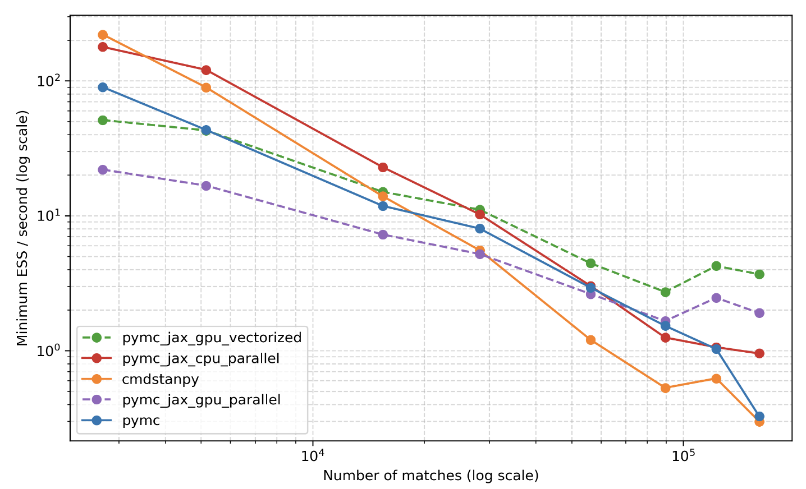

Team: David Galley, Caroline Pansard, Jiaqi Zhang, Julian Cooper

## Problem Overview
Cannot directly compute the posterior for most interesting models (intractable) 
and so need to approximate using a potentially expensive (slow) sampling algorithm.
Want to identify best algorithm and implementation (software) to use for the AllocAI 
Mixed Marketing Model (MMM).

## Takeaways 

0. **Effective sample size per second**. To pick between sampling methodologies 
and software implementations, we can use "effective sample size per second" as a 
comparison metric (arviz package). This strikes the right balance between *samples 
per second* and *auto-correlation*. 

1. **Try both HMC-NUTS & Variational Inference**. For a relatively complex model formulation (with difficult posterior to traverse), 
we should consider both HMC-NUTS and Variantional Inference methods. Variational 
Inference scales better to larger datasets (>50,000 rows) but converges to a more approximate 
posterior than HMC-NUTS, particularly for smaller datasets.

2. **NumPyro for HMC-NUTS**.  NumPyro is built with Theano/Aesara's linear algebra and 
computational graph libraries. It's HMC-NUTS implementation is custom-built to maximize 
JAX optimizations (jit, grad, vmap) and considered best-in-class for both small and 
large datasets.

3. **Pyro for Variational Inference**. Pyro is built on PyTorch's deep learning framework and is considered 
best-in-class for large datasets (>50,000 rows) if gpu hardware available. This is particularly useful for 
Variational Inference and Bayesian Neural Network model types. For small to medium 
datasets, Pyro will be slower that NumPyro, Edward2 and Stan for all MCMC 
sampling routines.

4. **PyMC 4.0 includes NumPyro API**. In June 2022, PyMC released a major re-write of its 
probabilistic programming language. Two main items: (1) started actively maintaining and 
developing Theano/Aesara backend, and (2) introduced integrations for NumPyro and BlackJAX. 
Unclear if actually as good as NumPyro (no published benchmarks), but I would be surprised 
if the difference is substantial.

5. **Parallelization for Auto-Diff & Multiple Chains**. There are two ways we can parallelize 
computation for bayesian inference: (1) vectorization and multi-threading on a single core 
(JAX library is best); and (2) scheduling multiple sample chains across cores (all platforms 
support this for cpu and gpu hardware).
  

## Sampling Methodologies (MCMC)
We typically evaluate sampling methods based on "effective sample size per second". This is 
really a combination of time per sample and auto-correlation. 

As model formulations become more complex, the other relevant criterion is "feasibility". For 
example, we cannot always solve analytically for the conditional distributions wrt each parameter, 
which rules out Gibbs sampling.

|                     | Metropolis Hastings                            | Gibbs Sampling                               | Hamiltonian Monte Carlo                          | No U-Turn Sampling                          | Variational Inference                                       |
|---------------------|---------------------                           |-----------------                             |-------------------------                         |--------------------                         |-----------------------                                      |
| time per step       | Fast. Compute Hastings Ratio at each step      | Lightening Fast! Direct sampling only        | Very slow! Re-computes graident at each step     | Slow! As good or better than HMC algorithm  | Lightening Fast! Sample directly from approx distribution Q |
| auto-correlation    | High! Often low number of "effective samples"  | Moderate. Significant improvement on MH      | Low! Gradient steps result in effective samples  | Low. As good or better than HMC algorithm   | None! We sample directly from an approximate posterior      |
| acceptance ratio    | Low. Problem if joint pdf is complex           | Not required (= 100%)                        | High. Acceptance more likely with gradient steps | High. Similar to HMC algorithm              | Not required (=100%)                                        |
| complex posteriors  | Low. Random walk if high-dim space             | Moderate, need conditional pdfs              | High. Leapfrog integrator adapts to complexity   | Best! Minimal wasted computation            | Low. Exacerbates inaccuracies of this method, no guarantees   |
| other comments      | Simple & fast, but crude for complex posterior | Best option if able to compute conditionals  | Pre NUTS, best-in-class for complex models       | Work horse of bayesian inference toolchains | Very useful for large datasets. To approximate for complex models, small dataset |

**Metropolis-Hastings** (MH) was developed in 1950s, 
with many subsequent MCMC techniques derived from it. Each chain starts with 
initialization of an arbitrary parameter vector $x$, then propose a step of random 
direction (picked from a Gaussian random walk distribution), and accept or reject 
based on the ratio of log probability evaluated at the proposed position vs the 
current positioni (hastings ratio). This acceptance criteria ensures we tend to 
move towards higher probability density regions more than lower density regions.

Hastings Ratio: let $q(\theta_0, \theta_1)$ be our transition density (often 
assumed symmetric and cancels) and $\pi(y,\theta)$ be our join density. Then, 
$$\text{accept prob.} = \min(1, \frac{q(\theta_0, \theta_1)\pi(y,\theta_1)}{q(\theta_1, \theta_0)\pi(y,\theta_0)})$$

 
**Gibbs Sampling** was developed in 1980s. The first fundamental departure from 
the Metropolis-Hasting algorithm. Main idea is to sample directly (without acceptance 
ratio) from conditional distributions for each parameter. This provides us a more 
principled way to navigate the posterior space than gaussian random walk and avoids 
the need to compute either graident or acceptance ratios for each step. Because of 
this, the algorithm is lightening fast and converges quickly! However, computing 
these condition distributions which can be tricky for larger problems.

Conditional distribution with respect to parameter $x_i$. Let $\{x_{-i}\} = \{x_1, x_2, ..., x_{i-1}, x_{i+1}, ..., x_n\}$,

$$ p(x_i|y, x_{-i}) = \frac{p(y,x)}{\int p(x, y) dx_{-i}} = \frac{p(y,x_{-i}|x_i) \cdot p(x_i))}{\int p(x, y) dx_{-i}} $$

**Hamiltonian Monte Carlo** (HMC) is an evolution of Metropolis-Hastings developed 
in the 1980/90s. Instead of a gaussian random walk, HMC proposes choosing step 
direction based on the "gradient of negative log likelihood". This approach 
is based on Hamiltonian mechanics. The system is propagated numerically using 
a "leapfrog integrator" which is important for the algorithm's stability.

Implementation: Compute the Hamiltonian $H(\rho, \theta)$ given independently drawn momentum $\rho$
and our current parameter values $\theta$. Note, $V(\theta) = -l(\theta) = -\log p(\theta|y)$.

$$ H(\theta, y) = -\log p(\rho, \theta)  - \log p(\rho|\theta) - \log p(\theta) =  V(\theta) + K(\rho, \theta) $$

We now evolve the system using the following equations from Hamiltonian mechanics. 
$$
\begin{aligned}
    \frac{d\theta}{dt} & = + \frac{\partial H}{\partial \rho} = + \frac{\partial K}{\partial \rho} + \frac{\partial V}{\partial \rho} = M^{-1} \rho \\
    \frac{d\rho}{dt}   & = - \frac{\partial H}{\partial \theta} = -\frac{\partial K}{\partial \theta} - \frac{\partial V}{\partial \theta} = -\frac{\partial V}{\partial \theta}
\end{aligned}
$$

Therefore, to implement the above system, we need only to calculate 
the gradient of our potential energy (negative log likelihood) with 
respect to our parameters $\theta$.

**No U-Turn Sampling** (NUTS) is an extension from HMC developed in early 2010s (Hoffman and Gelman). 
The main idea is to adaptively set the number of leapfrog steps $L$. This refers
the number of steps our numerical integrator takes with a given graident and is 
specified by the user as a hyperparameter in the HMC algorithm. 
If $L$ is too small, the algorithm exhibits an undesirable random walk behaviour. 
If $L$ is too large, the algorithm wastes computation. 
To find the golidlocks number of integration steps, we conitnue until a "U-Turn"
condition is satisfied. This is particularly effective in high-dimensional 
parameter spaces that are difficult to explore.

**Variational Inference** (VI) was developed in mid 2010s and can be viewed as an 
extension of the Expectation-Maximisation (EM) algorithm. Unlike the previous 
algorithms, VI is not a Monte Carlo sampling method. The main idea is to iteratively
maximize the likelihood of a proposal distribution $Q$ such that it converges 
to the true posterior (i.e. minimizes KL divergence). We do this by choosing 
parameters for $Q$ that maximize ELBO which is a tractable lower bound on the likelihood of 
our observed data and is a function of $q$. We can then sample directly from our 
distribution $Q$ to approximate the posterior.

For many applications, variational inference produces comparable results to Gibbs Sampling at similarly 
lightening fast speeds, but do not need to derive the conditional distributions 
to sample from. Assuming we pick a simple proposal distribution $Q$, the update 
equations for VI should be straight forward. 

Evidence Lower Bound (ELBO): Jensen's inequality applied to the log probability 
of the observations. This produces a useful lower-bound on the log-likelihood of some 
observed data. By choosing a good approximation $q$ of our posterior, we are 
maximizing the ELBO ($\mathbb{E}_q[l]$). 

$$ \log p(x) \ge \mathbb{E}_q[l] \approx \mathbb{E}_q[\log p(x, Z)] - \mathbb{E}_q[\log q(Z)] $$

KL divergence = negative ELBO + log marginal probability of $x$. Minimizing 
KL divergence is equivalent to maximizing the ELBO since the log marginal 
prob. ($\log p(x)$) does not depend on $q$.

$$ \text{KL}(q(z)|| p(z|x)) = -(\mathbb{E}_q[\log p(x, Z)] - \mathbb{E}_q[\log q(Z)] )+ \log p(x) $$

## Probabilistic Programming Languages
We consider the Probabilistic Programming Languages (PPLs) that offer 
a python development interface, including Stan, PyMC, Pyro, Edward2 and NumPyro.

While most of these languages offer the full range of MCMC sampling and model 
evaluation methods for bayesian inference, they differ substantially in their 
choice of backend (= host language they are compiled to). This produces 
differences in stability and speed of auto-differentiation, vectorization 
and hardware acceleration (multiple cpu or gpu cores).

|                        | STAN                                    | PYMC                                         | PYRO                                    | EDWARD2                                        | NUMPYRO                                          |
|-------------------     |--------------------                     |----------------------                        |----------------------                   | ----------------------                         |----------------------------                      |
| sampling methods       | HMC, NUTS, ADVI                         | M-H, Gibbs, HMC, NUTS, ADVI                  | HMC, NUTS, SVI                          | Gibbs, HMC, VI                                 | Gibbs, HMC, NUTS, VI                             |
| backend libraries      | Home-built, compiled in C++             | Theano/Aesara with JAX integration           | PyTorch framework                       | TensorFlow framework                           | Native JAX libraries                             |
| ease of use            | Beautiful declarative language          | Great support community, very pythonic       | Need familiarity with PyTorch           | Requires familiarity with TensorFlow           | Pyro interface but with access to JAX libraries  |
| hardware acceleration  | C++ multi-thread & MPI support          | JAX vectorization & CPU/GPU parallel support | CPU/GPU parallel support                | CPU/GPU parallel support                       | JAX vectorization & CPU/GPU parallel support     |
| other comments         | Best documentation, good for small data | Since 4.0 upgrade, best MCMC option          | Best for SVI and BNNets, large datasets | Some integration for JAX, not well adopted yet | Leightweight and fastest HMC-NUTS implementation |

   

**STAN** (2012) compiles into C++ with built-from-scratch auto-differentiation 
using Boost and Eigen libraries. First widespread implementation of HMC-NUTS. 
Still preferred by statisticians for small data problems due to declarative language 
and great documentation.

**PYMC** (2015/2022) built on top of Theano -> Aesara. Stores a lightweight static 
computational graph which is more appropriate for bayesian inference. Version 4.0 
introduced integration for JAX jit, vmap and grad libraries resulting it significant 
speed improvements.

**PYRO** (Uber, 2017) built on top of PyTorch (Facebook). Stores a memory-intensive dynamic 
computational graph. Really amazing for deep learning, especially RNNs or any generative models \
with variable input and output lengths, but generally slower for bayesian inference tasks.

**EDWARD2** (2018) built on top of TensorFlow (Google). Similar to Theano/Aesara, TensorFlow 
stores a static computational graph which is appropriate for bayesian inference models 
and provides the most opportunities for speed-ups.

**NUMPYRO** (2019) extends Pyro's modeling API to a different JAX-based backend. This enables 
better hardware acceleration (multiple cpu or gpu cores), auto-differentiation and 
vectorization. Custom-built HMC-NUTS end-to-end JAX implementation which is considered 
best in class. 

## Stretch ideas

Ensemble Sampling (Foreman-Mackey 2013) and Sample Adaptive MCMC (Michael Zhu, 2019)
are both very fast sampling methods that do not require gradient computations and 
claim to effectively explore complex posteriors. Might be worth a short.

## Useful references

Comparative analysis of CmdStanPy, PyMC 4.0 and NumPyro (Martin Ingram, Dec 2021, 
[[1]](https://martiningram.github.io/mcmc-comparison/)

NumPyro academic publication (Du Phan, Marrin Jankowiak, Dec 2019) 
[[2]](https://arxiv.org/abs/1912.11554)

PyMC 4.0 official release announcement (PyMC, June 2022)
[[3]](https://www.pymc.io/blog/v4_announcement.html)

Variational Inference practical walkthrough (Minh-Ngoc Tran, 2021)
[[4]](https://arxiv.org/pdf/2103.01327.pdf)

Linear algebra and computational graph toolkits: Theano/Aesara, TensorFlow, PyTorch and JAX (Yi Wang, Oct 2022)
[[5]](https://yi-wang-2005.medium.com/compare-deep-learning-toolkits-theano-tensorflow-tensorflow-2-0-pytorch-and-jax-115d50191810)

Static vs dynamic computational graphs (Manpreet Singh Minhas, Jan 2021)
[[6]](https://towardsdatascience.com/computational-graphs-in-pytorch-and-tensorflow-c25cc40bdcd1)

Best practitioners handbock I've come across (Cam Davidson-Pilon, 2015)
[[7]](https://github.com/CamDavidsonPilon/Probabilistic-Programming-and-Bayesian-Methods-for-Hackers/)

