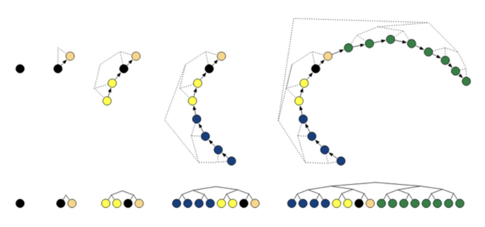
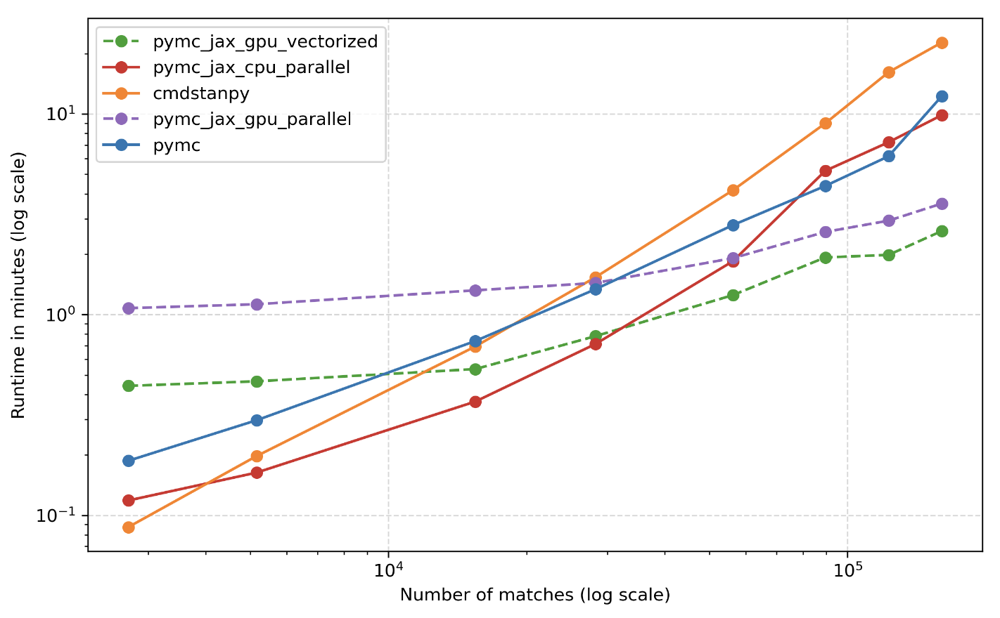
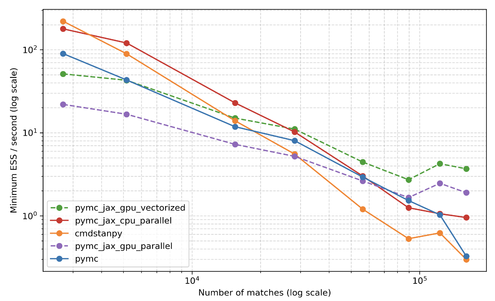
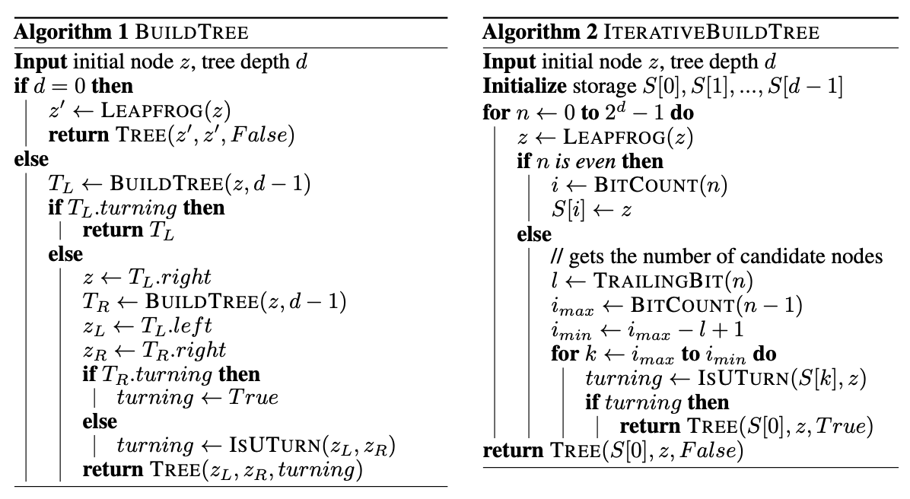

Team: David Galley, Caroline Pansard, Jiaqi Zhang, Julian Cooper

## Problem Overview
Cannot directly compute the posterior for most interesting models (intractable) 
and so need to approximate using a potentially expensive (slow) sampling algorithm.
Want to identify best algorithm and implementation (software) to use for the AllocAI 
Mixed Marketing Model (MMM).


---

## Takeaways 

1.	**Sampling method: NUTS & SVI are both worth implementing.** Our goal is to maximize “effective samples per second” which strikes the right balance samples per second and auto-correlation. For a relatively complex model formulation (i.e. difficult posterior to traverse, integral and conditionals analytically intractable) and datasets < 10,000 observations, NUTS is the best-in-class sampling algorithm. As the number of data points increases beyond 10,000 observations, and/or if the model formulation is sufficiently simple, Stochastic Variational Inference (SVI) can be an effective option, with significant speed improvements (no gradient step required!). It is hard to tell a priori whether SVI will work since no guarantees it converges to true posterior.[^1]

2.	**Software implementation: NumPyro is the best choice for NUTS, differences less obvious for SVI.** Modern Probabilistic Programming Languages (PPLs) all use deep learning frameworks as their backend: PyTorch for Pyro, JAX for NumPyro, Aesara for PyMC, TensorFlow for Edward2. In general, these all provide just-in-time compilation (JIT), automatic differentiation (auto-grad), BLAS library integrations, and hardware-agnostic multi-processing support. As of Sept. 2023, JAX is the only framework with a custom-built iterative version of NUTS algorithm that can be end-to-end JIT compiled![^2] Benchmarks are notoriously hard in this field (SVI likely similar across PPLs), but this makes JAX comfortably the most performant backend for NUTS. 

3.	**Programming Interface: Potentially small speed gain from switching to native NumPyro interface.** Currently our fastest model calls NumPyro’s NUTS implementation from PyMC 4.0’s API. This captures the majority of the speed benefits of NumPyro, however, there is likely some small overhead from not directly using NumPyro’s programming interface. We performed a toy experiment and estimated this impact to be approx. 20%. Since the NumPyro interface is very similar to PyMC, it might be worth testing for the alloc-ai model, but this is not the 10x breakthrough we were looking for.

4.	**Hardware acceleration: Limited benefits for NUTS sampling with < 4 chains.** Modern PPLs all provide hardware-agnostic multi-processing support. For gradient-based samplers like HMC or NUTS, the only significant parallelization opportunity is to run independent chains on separate devices (processors or cores), with speed-up available equal to the number of chains (2-4 for alloc-ai). For other sampling methods (e.g. SVI, Gibbs), the samples themselves can be spread across devices with much larger hardware speed-ups available.

[^1]: Caroline has tested for alloc-ai’s `ui_world` dataset and unfortunately SVI is not appropriate for our model. 
[^2]: See “NumPyro Implementation” section from attached notes for details on the JAX library.

   
---

## Sampling Methodologies (MCMC)
We typically evaluate sampling methods based on "effective sample size per second". This is 
really a combination of time per sample and auto-correlation. 

As model formulations become more complex, the other relevant criterion is "feasibility". For 
example, we cannot always solve analytically for the conditional distributions wrt each parameter, 
which rules out Gibbs sampling.

|                     | Metropolis Hastings                            | Gibbs Sampling                               | Hamiltonian Monte Carlo                          | No U-Turn Sampling                          | Variational Inference                                       |
|---------------------|---------------------                           |-----------------                             |-------------------------                         |--------------------                         |-----------------------                                      |
| time per step       | Fast. Compute Hastings Ratio at each step      | Lightening Fast! Direct sampling only        | Very slow! Re-computes graident at each step     | Slow! As good or better than HMC algorithm  | Lightening Fast! Sample directly from approx distribution Q |
| auto-correlation    | High! Often low number of "effective samples"  | Moderate. Significant improvement on MH      | Low! Gradient steps result in effective samples  | Low. As good or better than HMC algorithm   | None! We sample directly from an approximate posterior      |
| acceptance ratio    | Low. Problem if joint pdf is complex           | Not required (= 100%)                        | High. Acceptance more likely with gradient steps | High. Similar to HMC algorithm              | Not required (=100%)                                        |
| complex posteriors  | Low. Random walk if high-dim space             | Moderate, need conditional pdfs              | High. Leapfrog integrator adapts to complexity   | Best! Minimal wasted computation            | Low. Exacerbates inaccuracies of this method, no guarantees   |
| other comments      | Simple & fast, but crude for complex posterior | Best option if able to compute conditionals  | Pre NUTS, best-in-class for complex models       | Work horse of bayesian inference toolchains | Very useful for large datasets. To approximate for complex models, small dataset |

**Metropolis-Hastings** (MH) was developed in 1950s, 
with many subsequent MCMC techniques derived from it. Each chain starts with 
initialization of an arbitrary parameter vector $x$, then propose a step of random 
direction (picked from a Gaussian random walk distribution), and accept or reject 
based on the ratio of log probability evaluated at the proposed position vs the 
current positioni (hastings ratio). This acceptance criteria ensures we tend to 
move towards higher probability density regions more than lower density regions.

Hastings Ratio: let $q(\theta_0, \theta_1)$ be our transition density (often 
assumed symmetric and cancels) and $\pi(y,\theta)$ be our join density. Then, 
$$\text{accept prob.} = \min(1, \frac{q(\theta_0, \theta_1)\pi(y,\theta_1)}{q(\theta_1, \theta_0)\pi(y,\theta_0)})$$

 
**Gibbs Sampling** was developed in 1980s. The first fundamental departure from 
the Metropolis-Hasting algorithm. Main idea is to sample directly (without acceptance 
ratio) from conditional distributions for each parameter. This provides us a more 
principled way to navigate the posterior space than gaussian random walk and avoids 
the need to compute either graident or acceptance ratios for each step. Because of 
this, the algorithm is lightening fast and converges quickly! However, computing 
these condition distributions which can be tricky for larger problems.

Conditional distribution with respect to parameter $x_i$. Let $\{x_{-i}\} = \{x_1, x_2, ..., x_{i-1}, x_{i+1}, ..., x_n\}$,

$$ p(x_i|y, x_{-i}) = \frac{p(y,x)}{\int p(x, y) dx_{-i}} = \frac{p(y,x_{-i}|x_i) \cdot p(x_i))}{\int p(x, y) dx_{-i}} $$

**Hamiltonian Monte Carlo** (HMC) is an evolution of Metropolis-Hastings developed 
in the 1980/90s. Instead of a gaussian random walk, HMC proposes choosing step 
direction based on the "gradient of negative log likelihood". This approach 
is based on Hamiltonian mechanics. The system is propagated numerically using 
a "leapfrog integrator" which is important for the algorithm's stability.

Implementation: Compute the Hamiltonian $H(\rho, \theta)$ given independently drawn momentum $\rho$
and our current parameter values $\theta$. Note, $V(\theta) = -l(\theta) = -\log p(\theta|y)$.

$$ H(\theta, y) = -\log p(\rho, \theta)  - \log p(\rho|\theta) - \log p(\theta) =  V(\theta) + K(\rho, \theta) $$

We now evolve the system using the following equations from Hamiltonian mechanics. 
$$
\begin{aligned}
    \frac{d\theta}{dt} & = + \frac{\partial H}{\partial \rho} = + \frac{\partial K}{\partial \rho} + \frac{\partial V}{\partial \rho} = M^{-1} \rho \\
    \frac{d\rho}{dt}   & = - \frac{\partial H}{\partial \theta} = -\frac{\partial K}{\partial \theta} - \frac{\partial V}{\partial \theta} = -\frac{\partial V}{\partial \theta}
\end{aligned}
$$

Therefore, to implement the above system, we need only to calculate 
the gradient of our potential energy (negative log likelihood) with 
respect to our parameters $\theta$.


**No U-Turn Sampling** (NUTS) is an extension from HMC developed in early 2010s (Hoffman and Gelman). 
The main idea is to adaptively set the number of leapfrog steps $L$. This refers
the number of steps our numerical integrator takes with a given graident and is 
specified by the user as a hyperparameter in the HMC algorithm. 
If $L$ is too small, the algorithm exhibits an undesirable random walk behaviour. 
If $L$ is too large, the algorithm wastes computation. 
To find the golidlocks number of integration steps, we conitnue until a "U-Turn"
condition is satisfied. This is particularly effective in high-dimensional 
parameter spaces that are difficult to explore.



Figure 1 shows an example of building a binary tree via repeated doubling. 
Each doubling proceeds by choosing a direction (forwards or backwards) 
uniformly at random, then simulating Hamiltonian dynamics for $2^{j}$ 
leapfrog steps in that direction, where $j$ is the number of previous 
doublings (and the height of the binary tree). 


**Variational Inference** (VI) was developed in mid 2010s and can be viewed as an 
extension of the Expectation-Maximisation (EM) algorithm. Unlike the previous 
algorithms, VI is not a Monte Carlo sampling method. The main idea is to iteratively
maximize the likelihood of a proposal distribution $Q$ such that it converges 
to the true posterior (i.e. minimizes KL divergence). We do this by choosing 
parameters for $Q$ that maximize ELBO which is a tractable lower bound on the likelihood of 
our observed data and is a function of $q$. We can then sample directly from our 
distribution $Q$ to approximate the posterior.

For many applications, variational inference produces comparable results to Gibbs Sampling at similarly 
lightening fast speeds, but do not need to derive the conditional distributions 
to sample from. Assuming we pick a simple proposal distribution $Q$, the update 
equations for VI should be straight forward. 

Evidence Lower Bound (ELBO): Jensen's inequality applied to the log probability 
of the observations. This produces a useful lower-bound on the log-likelihood of some 
observed data. By choosing a good approximation $q$ of our posterior, we are 
maximizing the ELBO ($\mathbb{E}_q[l]$). 

$$ \log p(x) \ge \mathbb{E}_q[l] \approx \mathbb{E}_q[\log p(x, Z)] - \mathbb{E}_q[\log q(Z)] $$

KL divergence = negative ELBO + log marginal probability of $x$. Minimizing 
KL divergence is equivalent to maximizing the ELBO since the log marginal 
prob. ($\log p(x)$) does not depend on $q$.

$$ \text{KL}(q(z)|| p(z|x)) = -(\mathbb{E}_q[\log p(x, Z)] - \mathbb{E}_q[\log q(Z)] )+ \log p(x) $$


---

*Reference documentation*

- The No-U-Turn Sampler: Adaptively Setting Path Lengths in Hamiltonian Monte Carlo (Gelman & Hoffman, 2011) [[1]](https://arxiv.org/pdf/1111.4246.pdf)

- Variational Inference: A Review for Statisticians (Blei, Kucukelbir & McAuliffe, 2018) [[2]](https://arxiv.org/pdf/1601.00670.pdf)

- Overview of MCMC Sampling Metholodies (Julian Cooper, 2022) [[3]](./mcmc-sampling-methodologies.pdf)

---


## Probabilistic Programming Languages
We consider the Probabilistic Programming Languages (PPLs) that offer 
a python development interface, including Stan, PyMC, Pyro, Edward2 and NumPyro.

While most of these languages offer the full range of MCMC sampling and model 
evaluation methods for bayesian inference, they differ substantially in their 
choice of backend (= host language they are compiled to). This produces 
differences in stability and speed of auto-differentiation, vectorization 
and hardware acceleration (multiple cpu or gpu cores).


|                        | Stan                                    | PyMC                                         | Pyro                                    | Edward2                                        | NumPyro                                          |
|-------------------     |--------------------                     |----------------------                        |----------------------                   | ----------------------                         |----------------------------                      |
| sampling methods       | HMC, NUTS, ADVI                         | M-H, Gibbs, HMC, NUTS, ADVI                  | HMC, NUTS, SVI                          | Gibbs, HMC, VI                                 | Gibbs, HMC, NUTS, VI                             |
| backend libraries      | Home-built, compiled in C++             | Theano/Aesara with JAX integration           | Facebook's PyTorch framework (2016)     | Google's TensorFlow framework (2015)           | Google's JAX framework (2018)                    |
| ease of use            | Beautiful declarative language          | Great support community, very pythonic       | Need familiarity with PyTorch           | Requires familiarity with TensorFlow           | Pyro interface but with access to JAX libraries  |
| hardware acceleration  | C++ multi-thread & MPI support          | JAX vectorization & CPU/GPU parallel support | CPU/GPU parallel support                | CPU/GPU parallel support                       | JAX vectorization & CPU/GPU parallel support     |
| other comments         | Best documentation, good for small data | Since 4.0 upgrade, best MCMC option          | Best for SVI and BNNets, large datasets | Some integration for JAX, not well adopted yet | Leightweight and fastest HMC-NUTS implementation |


   

**Stan** (2012) compiles into C++ with built-from-scratch auto-differentiation 
using Boost and Eigen libraries. First widespread implementation of HMC-NUTS. 
Still preferred by statisticians for small data problems due to declarative language 
and great documentation.

**PyMC** (PyMC3 2015 / v4.0 2022) built on top of Theano -> Aesara. Stores a lightweight static 
computational graph which is more appropriate for bayesian inference. Version 4.0 
introduced integration for JAX jit, vmap and grad libraries resulting it significant 
speed improvements.

**Pyro** (Uber, 2017) built on top of PyTorch (Facebook). Stores a memory-intensive dynamic 
computational graph. Really amazing for deep learning, especially RNNs or any generative models \
with variable input and output lengths, but generally slower for bayesian inference tasks.

**Edward2** (2018) built on top of TensorFlow (Google). Similar to Theano/Aesara, TensorFlow 
stores a static computational graph which is appropriate for bayesian inference models 
and provides the most opportunities for speed-ups.

**NumPyro** (2019) extends Pyro's modeling API to a different JAX-based backend. This enables 
better hardware acceleration (multiple cpu or gpu cores), auto-differentiation and 
vectorization. Custom-built HMC-NUTS end-to-end JAX implementation which is considered 
best in class. 


---

*Reference documentation*

- NumPyro: Composable Effects for Flexible and Accelerated Probabilistic Programming (UberAI: Phan, Pradhan & Jankowiak, 2019) [[4]](https://arxiv.org/pdf/1912.11554.pdf)

- Pyro: Deep Universal Probabilistiv Programming (UberAI: Bingham et al., 2018) [[5]](https://arxiv.org/pdf/1810.09538.pdf)

- PyMC 4.0 Release Announcement (Willard, Vieira & Chaudhari, 2022) [[6]](https://www.pymc.io/blog/v4_announcement.html)

- Comparative analysis of CmdStanPy, PyMC 4.0 and NumPyro (Ingram, 2021) [[7]](https://martiningram.github.io/mcmc-comparison/)

- Deep Learning Libraries: Aesara, TensorFlow, PyTorch and JAX (Wang, 2022) [[8]](https://yi-wang-2005.medium.com/compare-deep-learning-toolkits-theano-tensorflow-tensorflow-2-0-pytorch-and-jax-115d50191810)

---


## NumPyro: Pyro with NumPy and JAX
NumPyro is a lightweight probabilistic programming library that provides a 
NumPy backend for Pyro. We rely on JAX for automatic differentiation and JIT 
compilation to GPU / CPU.


**Interacting with NumPyro's API**:
It's not so bad! While Pyro's backend is written in PyTorch, its user API is 
very similar to PyMC ([example](https://pyro.ai/examples/bayesian_regression_ii.html)).
NumPyro adopts an identical user API. See code comparaison below for a simple 
linear regression model formulation. (Note, I've included a non-standard line 
parameterization to illustrate "transformed parameters".)


*PyMC --->*
```python
import pymc as pm
import numpy as np

with Model() as model:
    # specify our parameter priors
    theta = pm.Uniform("theta", -0.5*np.pi, 0.5*np.pi)
    b_perp = pm.Normal("b_perp", 0, sigma=1)

    # transformed parameters we want to keep track of during sampling
    m = pm.Deterministic("m", np.tan(theta))
    b = pm.Deterministic("b", b_perp / np.cos(theta))

    # likelihood function 
    likelihood = pm.Normal("y", mu=m*x+b, sigma=yerr, observed=y)

    # sample from posterior (inference)
    %time inf_data = sampling_jax.sample_numpyro_nuts(2000, chains=2)
    
```


*NumPyro --->*
```python
import jax
import numpyro

import arviz as az
import numpy as np
import jax.numpy as jnp

from numpyro import distributions as dist, infer

def linear_model(x, yerr, y=None):
    # specify our parameter priors
    theta = numpyro.sample("theta", dist.Uniform(-0.5 * jnp.pi, 0.5 * jnp.pi))
    b_perp = numpyro.sample("b_perp", dist.Normal(0, 1))

    # transformed parameters we want to keep track of during sampling
    m = numpyro.deterministic("m", jnp.tan(theta))
    b = numpyro.deterministic("b", b_perp / jnp.cos(theta))

    # likelihood function 
    with numpyro.plate("data", len(x)):
        numpyro.sample("y", dist.Normal(m * x + b, yerr), obs=y)

# sample from posterior (inference)
sampler = infer.MCMC(
    infer.NUTS(linear_model),
    num_warmup=2000,
    num_samples=2000,
    num_chains=2,
    progress_bar=True,
)
%time sampler.run(jax.random.PRNGKey(0), x, yerr, y=y)

# extract inference data table fron sampler object
inf_data = az.from_numpyro(sampler)
```


If one wanted to interrogate or make changes to the backend codebase for either 
Pyro or NumPyro, you would need to work in PyTorch or NumPy / JAX, but assuming we just
want to specify and run models, the interfaces should not be considered an obstacle.

 

**Components of the JAX python library**:
Deepmind built JAX in 2018 to replace Tensorflow and compete with Meta's PyTorch.
Similarly to PyTorch, Aesara and Tensorflow, JAX is a python library purpose-built 
to speed up numeric computations. All of these libraries are primarily used for 
deep learning applications, but are also useful for PPLs due to their respective 
high-performance implementations for `autograd`. 

- *Just-In-Time Compilation* (`jit`): Python is an interpreted language which 
  means that statements are executed (sent to the compiler) one at a time. 
  With JIT-compiled languages or functions, the compiler is sent a batch of 
  statements are is allowed to optimize how it computes them. 


  ```python
  import jax
  import jax.numpy as jnp

  def selu(x, alpha=1.67, lambda_=1.05):
    return lambda_ * jnp.where(x > 0, x, alpha * jnp.exp(x) - alpha)

  x = jnp.arange(1000000)

  selu(x)

  # selu_jit = jax.jit(selu)
  # selu_jit(x)
  ```

  The above `selu` function includes six `jax.numpy` operations: 
  `jnp.exp`, `jnp.multiply`, `jnp.subtract`, `jnp.gt`, `jnp.where`, and another `jnp.multiply`.
  Both x86 and RISC instruction sets have a "fused instruction" for $a * \exp{b}$ and 
  so by passing these two to the compiler at once it can execute with a single
  instruction to the processing unit. Beyond fused instructions, the other most 
  common speed up comes from sibling instructions (same instruction on multiple
  data inputs). More on that in parallel processing section.

  JAX uses Google's old (but amazing) XLA library from the TensorFlow 
  framework. The `jit` wrapper is what allows JAX to maximize the speed 
  benefits of XLA for linear algebra operations. In particular, when we use
  `jit`, JAX is replaces "NumPy arrays" with "JAX tracers" under-the-hood.
  Like PyTorch's "tensors", a tracer is really just an array that records
  its own computational graph. This incurs some memory overhead but enables 
  JAX to pass more operations at once to XLA for compilation.

   
- *Automatic differentiation* (`grad`): For gradient-based sampling methods 
  like HMC and NUTS, one can either derive and provide the hamiltonian 
  gradient directly to the sampler or pass the computational graph used 
  to produce the hamiltonian to JAX's `grad` function. 

  Passing a computational graph is made simple by using JAX's array types 
  (tracers) which automatically store everything needed for `grad` to 
  perform automatic differentiation. In NumPyro's HMC-NUTS implementation,
  `grad` is used with `jit` wrapper to maximize the speed-up available 
  with XLA compiler for the expensive gradient compute at each sampler 
  step. This is were most of the JAX magic comes from!
  

  ```python
  def sum_logistic(x):
    return jnp.sum(1.0 / (1.0 + jnp.exp(-x)))

  x_small = jnp.arange(3.)
  derivative_fn = grad(sum_logistic)
  print(derivative_fn(x_small))
  # [0.25, 0.19661197, 0.10499357]
  ```

  The core developers of `autograd`(Maclaurin, Duvenaud, Johnson and Townsend) 
  have moved to the JAX core dev team and were responsible for writing `grad`.


- *Custom-built HMC-NUTS algorithm* ([`nuts`](https://github.com/pyro-ppl/numpyro/wiki/Iterative-NUTS)): 
  The original HMC-NUTS algorithm implements a `BuildTree` subroutine which 
  recursively builds a binary tree to efficiently find the number of leapfrog 
  steps $L$ we should take along a given trajectory (ie. test for u-turn 
  condition). Unfortunately recursive conditions like this limit batching 
  of operations for the compiler (cannot use `jit`)!

  The NumPyro team proposed an alternate "iterative" method for building a 
  subtree with some specified depth $d$. `jit` wrapper can now be applied
  to the entire `BuildTree` subroutine.

  


- *Parallel Processing* (`pmap` & `vmap`): In general, there are two ways to 
  parallelize the HMC-NUTS algorithm: 
    
    - `pmap` (hardware acceleration): Single Program Multiple Device (SPMD). 
    Idea is to run each chain as a separate program on a different device. 
    A device in this case can just mean separate CPU cores or entirely 
    separate processor units (CPU / GPU / TPU).
     
    - `vmap` (vectorizaton): Single Instruction Multiple Data (SIMD). 
    Idea is to parallelize computation at the instruction level on the same 
    processor. We do this whenever we work with NumPy vector rather than 
    for loops and lists. The speed-up comes from both (a) loading data as a
    block rather than repeated cache / memory / storage requests, and (b) 
    applying single instruction to multiple data instances in register. 
    For HMC-NUTS, this is used within the sampler itself for any transform 
    or gradient vector operations. 
  
   Note, the opportunity for parallelization is much greater for non-gradient 
   based MCMC sampling methods (M-H, Gibbs, etc.) since each subsequent 
   sample is not dependent on the previous sample (step) taken.

  
**PyMC's NumPyro API speed test**:
Using a model formulation and synthetic dataset taken from [Foreman-Mackey's blog](https://dfm.io/posts/intro-to-numpyro/) 
I ran a short experiment to see if PyMC's API would incur meaningful overhead costs 
when running  NumPyro's NUTS implementation ([jupyter nb](./numpyro.pdf)).


|         | PyMC API | NumPyro | Speed-up |
|---------|----------|---------|----------|
| simple  |   1.87   |   1.87  |    0%    |
| complex |   3.75   |   3.01  |   20%    |

Note, we do not consider gpu acceleration since our Marketing Mix problem does not 
involve a large enough dataset for this to be worthwhile (message passing overhead 
outweigh benefit of parallel processing).

*Takeaway*: potential (likely small) speed up available for sufficiently complex 
model formulations. Since easy enough to migrate model, this is surely worth a try!


---

*Reference Documentation*

- NumPyro: Composable Effects for Flexible and Accelerated Probabilistic Programming (UberAI: Phan, Pradhan & Jankowiak, 2019) [[4]](https://arxiv.org/pdf/1912.11554.pdf)

- JAX Official Documentation: How to Think in JAX (Deepmind, 2023) [[9]](https://jax.readthedocs.io/en/latest/notebooks/thinking_in_jax.html)

- Operator Fusion in XLA: Analysis and Evaluation (Snider & Liang, 2023) [[10]](https://arxiv.org/pdf/2301.13062.pdf)

- Astronomer's Guide to Programming with NumPyro (Foreman-Mackey, 2022) [[11]](https://dfm.io/posts/intro-to-numpyro/)

- StackOverflow: Why is JAX's `jit` needed for `jax.numpy` operations [[12]](https://stackoverflow.com/questions/75138443/why-is-jax-jit-needed-for-jax-numpy-operations)

---

